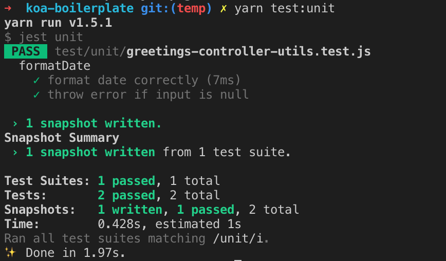
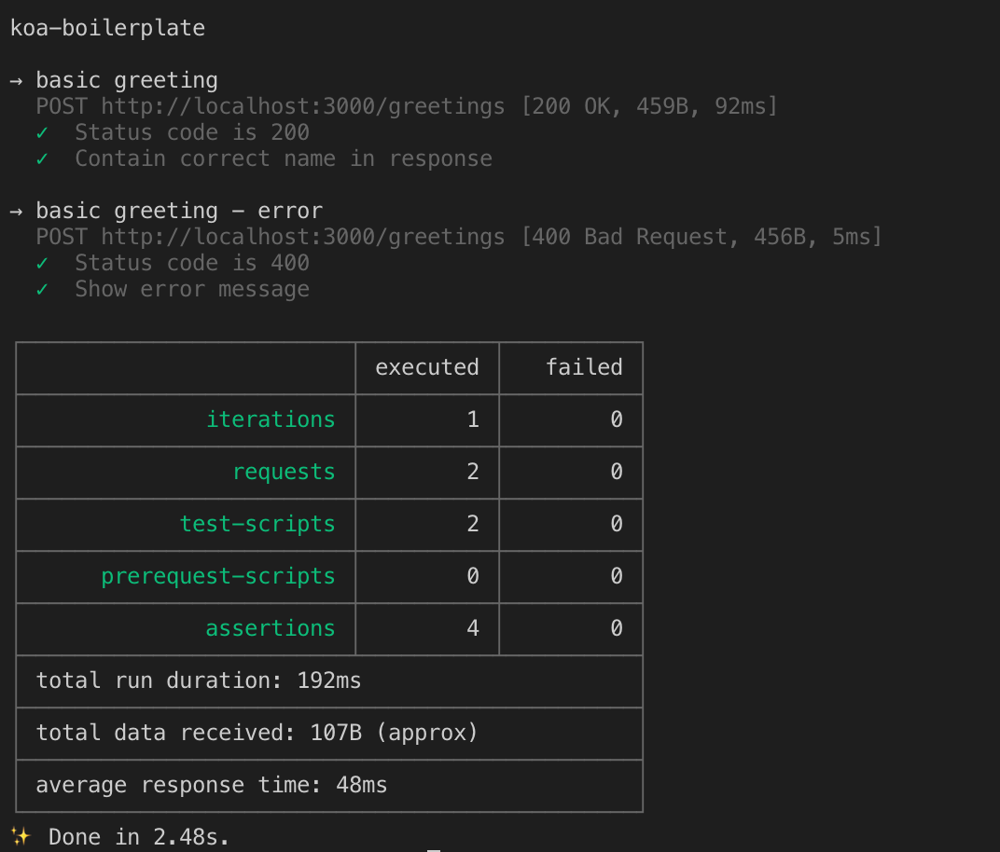

# Koa Boilerplate

## Best practices

- Environment setting separation with _dotenv_
- Centralize error handling in middleware
- Unit test with _Jest_
  - use Jest's snapshot feature to ease test result creation.
- End-to-end test automation with _Newman_ (Postman CLI)
- Aync logging with _Winston_
- Force code formatting and linting before commit
- Docker ready
- Kubernetes ready

### Installation

1. Install [Node.js](https://nodejs.org/en/download/package-manager/) latest version
2. Clone this repo
3. Install dependencies by running `yarn`

### Usage

1. run `yarn start` to start server

### Testing

1. run `yarn test` for tests

### Server Configuration (optional)

You can use `.env` file, to configure project like this:

```
NODE_ENV=development
PORT=3000
```

### Unit test



### End-to-end test


